---

# Project Report 


---

## Presenters
- **Daniel Shalom Cohen** - ID: 212991749
- **Nati Stern** - ID: 322879255


## Table of Contents
### stage 1
1. [Introduction](#introduction)
2. [ERD and DSD Diagrams](#erd-and-dsd-diagrams)
3. [Design Decisions](#design-decisions)
4. [Create Table and desc Commands](#Create-Table-and-desc-Commands)
5. [Data Entry Methods](#data-entry-methods)
6. [Data Backup and Restoration](#data-backup-and-restoration)

### stage 2
1. [Queries Without Parameters](#Queries-Without-Parameters)
2. [Queries With Parameters](#Queries-With-Parameters)
3. [Delete Queries](#Delete-Queries)
4. [Update Queries](#Update-Queries)
5. [Constraints](#Constraints)

### stage 3
1. [Procedures](#procedures)
2. [Functions](#functions)
3. [Main Programs](#Main-Programs)

### stage 4
1. [ERD and DSD](#Erd-and-Dsd)
2. [Integration Decisions](#integration-decisions)
3. [The Process and Commands](#the-process-and-commands)
4. [Views](#Views)
5. [Views Queries](#views-queries)

---

 # Stage 1 Report

---
### Introduction 

This system serves as a comprehensive database management tool for managing students, teachers, classes, schedules, subjects, and classrooms in an educational institution. It enables efficient organization and tracking of academic data, including student information, class schedules, teacher assignments, and classroom details.

#### Data Description:

1. **Student:**
   - **Description:** Represents individual students enrolled in the educational institution.
   - **Attributes:**
     - First_Name: First name of the student.
     - Last_Name: Last name of the student.
     - Student_ID: Unique identifier for each student.
     - Date_Birth: Date of birth of the student.
     - Gradesheats: Grade level or academic year of the student.
     - Address: Address of the student.
   - **Purpose:** Tracks student demographics, academic records, and enrollment details.

2. **Teacher:**
   - **Description:** Represents educators employed by the educational institution.
   - **Attributes:**
     - Teacher_ID: Unique identifier for each teacher.
     - F_Name: First name of the teacher.
     - L_Name: Last name of the teacher.
     - Title: Title or designation of the teacher.
     - Rank: Level or rank of the teacher (e.g., junior, senior).
   - **Purpose:** Stores information about teachers' profiles, qualifications, and assignments.

3. **Subject:**
   - **Description:** Represents academic subjects offered by the educational institution.
   - **Attributes:**
     - Subject_ID: Unique identifier for each subject.
     - Name: Name or title of the subject.
     - Detail: Additional details or description of the subject.
   - **Purpose:** Catalogs information about the curriculum, course offerings, and academic disciplines.

4. **Classroom:**
   - **Description:** Represents physical spaces used for conducting classes.
   - **Attributes:**
     - Classroom_ID: Unique identifier for each classroom.
     - Room_Type: Type or category of the classroom (e.g., lecture hall, laboratory).
     - Capacity: Maximum seating capacity of the classroom.
   - **Purpose:** Maintains details about classroom facilities, capacities, and availability.

5. **TeachAssign:**
   - **Description:** Represents assignments of teachers to specific subjects.
   - **Attributes:**
     - Subject_ID: Foreign key referencing the Subject table.
     - Teacher_ID: Foreign key referencing the Teacher table.
     - DateAssign: Date of joining to study a subject.
   - **Purpose:** Establishes relationships between teachers and subjects they are assigned to teach.

6. **Class:**
   - **Description:** Represents individual classes or courses offered by the educational institution.
   - **Attributes:**
     - Class_ID: Unique identifier for each class.
     - PERIODD: Period or session of the class.
     - Time: Time schedule of the class.
     - Classroom_ID: Foreign key referencing the Classroom table.
     - Subject_ID: Foreign key referencing the Subject table.
     - Teacher_ID: Foreign key referencing the Teacher table.
   - **Purpose:** Organizes class schedules and links them to specific subjects, teachers, and classrooms.

7. **Schedule:**
   - **Description:** Represents schedules or timetables for classes.
   - **Attributes:**
     - Schedule_ID: Unique identifier for each schedule entry.
     - ClassDate: Date of the class.
     - Student_ID: Foreign key referencing the Student table.
     - Class_ID: Foreign key referencing the Class table.
   - **Purpose:** Records class schedules for individual students.

8. **StudentClass:**
   - **Description:** Represents the enrollment of students in specific classes.
   - **Attributes:**
     - Student_ID: Foreign key referencing the Student table.
     - Class_ID: Foreign key referencing the Class table.
   - **Purpose:** Establishes relationships between students and classes they are enrolled in.

The system aims to facilitate efficient management of academic data and streamline processes related to student enrollment, class scheduling, teacher assignments, and curriculum management.
***

### ERD and DSD Diagrams


### Design Decisions

In designing the database schema, careful consideration was given to the establishment of foreign keys to enforce referential integrity and maintain relationships between different tables. Here's an explanation of each foreign key and its related table:

#### TeachAssign Foreign Keys:
- **Subject_ID:** This foreign key references the `Subject` table's `Subject_ID` column, establishing a relationship between the `TeachAssign` table and the `Subject` table to indicate which subjects are assigned to teachers.
- **Teacher_ID:** This foreign key references the `Teacher` table's `Teacher_ID` column, establishing a relationship between the `TeachAssign` table and the `Teacher` table to indicate which teachers are assigned to teach specific subjects.

#### Class Foreign Keys:
- **Classroom_ID:** This foreign key references the `Classroom` table's `Classroom_ID` column, establishing a relationship between the `Class` table and the `Classroom` table to indicate which classroom is assigned to a particular class.
- **Subject_ID:** This foreign key references the `Subject` table's `Subject_ID` column, establishing a relationship between the `Class` table and the `Subject` table to indicate which subject is being taught in a particular class.
- **Teacher_ID:** This foreign key references the `Teacher` table's `Teacher_ID` column, establishing a relationship between the `Class` table and the `Teacher` table to indicate which teacher is assigned to teach a particular class.

#### Schedule Foreign Keys:
- **Student_ID:** This foreign key references the `Student` table's `Student_ID` column, establishing a relationship between the `Schedule` table and the `Student` table to indicate which student is enrolled in a particular class schedule.
- **Class_ID:** This foreign key references the `Class` table's `Class_ID` column, establishing a relationship between the `Schedule` table and the `Class` table to indicate which class the schedule is associated with.

#### StudentClass Foreign Keys:
- **Student_ID:** This foreign key references the `Student` table's `Student_ID` column, establishing a relationship between the `StudentClass` table and the `Student` table to indicate which student is enrolled in a particular class.
- **Class_ID:** This foreign key references the `Class` table's `Class_ID` column, establishing a relationship between the `StudentClass` table and the `Class` table to indicate which class the student is enrolled in.

These foreign key relationships ensure the integrity of the database and maintain consistency between related tables, enabling accurate data retrieval and manipulation.
***

### Create Table and desc Commands

#### Create Table Command


```sql
CREATE TABLE Student
(
  First_Name VARCHAR(10) NOT NULL,
  Student_ID INT NOT NULL,
  Date_Birth DATE NOT NULL,
  Gradesheats INT NOT NULL,
  Address VARCHAR(20) NOT NULL,
  Last_Name VARCHAR(10) NOT NULL,
  PRIMARY KEY (Student_ID)
);

CREATE TABLE Teacher
(
  Teacher_ID INT NOT NULL,
  L_Name VARCHAR(10) NOT NULL,
  F_Name VARCHAR(10) NOT NULL,
  Title VARCHAR(10) NOT NULL,
  Rank INT NOT NULL,
  PRIMARY KEY (Teacher_ID)
);

CREATE TABLE Subject
(
  Subject_ID INT NOT NULL,
  Name VARCHAR(50) NOT NULL,
  Detail VARCHAR(100) NOT NULL,
  PRIMARY KEY (Subject_ID)
);

CREATE TABLE Classroom
(
  Room_Type VARCHAR(10) NOT NULL,
  Capacity INT NOT NULL,
  Classroom_ID INT NOT NULL,
  PRIMARY KEY (Classroom_ID)
);

CREATE TABLE TeachAssign
(
  DateAssign DATE,
  Subject_ID INT NOT NULL,
  Teacher_ID INT NOT NULL,
  PRIMARY KEY (Subject_ID, Teacher_ID),
  FOREIGN KEY (Subject_ID) REFERENCES Subject(Subject_ID),
  FOREIGN KEY (Teacher_ID) REFERENCES Teacher(Teacher_ID)
);

CREATE TABLE Class
(
  Class_ID INT NOT NULL,
  PERIODD VARCHAR(10) NOT NULL,
  Time VARCHAR(10) NOT NULL,
  Classroom_ID INT NOT NULL,
  Subject_ID INT NOT NULL,
  Teacher_ID INT NOT NULL,
  PRIMARY KEY (Class_ID),
  FOREIGN KEY (Classroom_ID) REFERENCES Classroom(Classroom_ID),
  FOREIGN KEY (Subject_ID) REFERENCES Subject(Subject_ID),
  FOREIGN KEY (Teacher_ID) REFERENCES Teacher(Teacher_ID)
);

CREATE TABLE Schedule
(
  ClassDate VARCHAR(10) NOT NULL,
  Schedule_ID INT NOT NULL,
  Student_ID INT NOT NULL,
  Class_ID INT NOT NULL,
  PRIMARY KEY (Schedule_ID),
  FOREIGN KEY (Student_ID) REFERENCES Student(Student_ID),
  FOREIGN KEY (Class_ID) REFERENCES Class(Class_ID)
);

CREATE TABLE StudentClass
(
  Student_ID INT NOT NULL,
  Class_ID INT NOT NULL,
  PRIMARY KEY (Student_ID, Class_ID),
  FOREIGN KEY (Student_ID) REFERENCES Student(Student_ID),
  FOREIGN KEY (Class_ID) REFERENCES Class(Class_ID)
);
```
#### Desc Command

***

### Data Entry Methods
- Data Generate file.
- Text file.
- Python script.


**Data Generate file:**

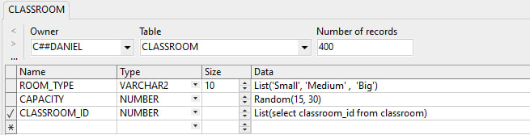

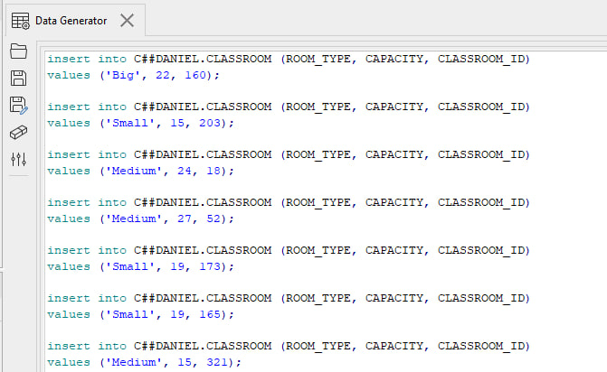


**Text file:**

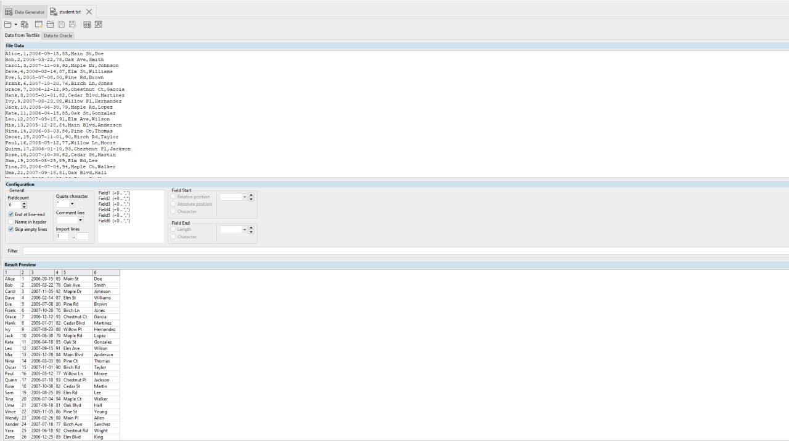

**Python script:**
```python
import random
import string

# Function to generate a random string for L_Name, F_Name, and Title
def random_string(length):
    letters = string.ascii_letters
    return ''.join(random.choice(letters) for _ in range(length))

# Number of records to insert
num_records = 500

# Generate SQL insert queries
queries = []
for i in range(1, num_records + 1):
    teacher_id = i
    l_name = random_string(10)  # Generate a random string of length 10 for L_Name
    f_name = random_string(10)  # Generate a random string of length 10 for F_Name
    title = random_string(10)   # Generate a random string of length 10 for Title
    level = random.randint(1, 10)  # Generate a random integer between 1 and 10 for Level
    query = f"INSERT INTO Teacher (Teacher_ID, L_Name, F_Name, Title, Level) VALUES ({teacher_id}, '{l_name}', '{f_name}', '{title}', {level});"
    queries.append(query)

# Write queries to a file
with open('insert_queries.sql', 'w') as f:
    for query in queries:
        f.write(query + '\n')
```
***
### Data Backup and Restoration


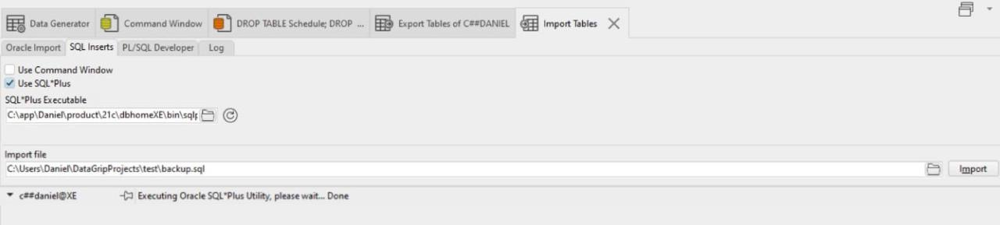


---

# Stage 2 Report


---

## Queries Without Parameters

#### Query 1: This query finds out how many students each teacher has on average. It first counts the students in each class and then averages these counts for each teacher. Finally, it shows the average number of students for each teacher, sorted by the teacher's ID.
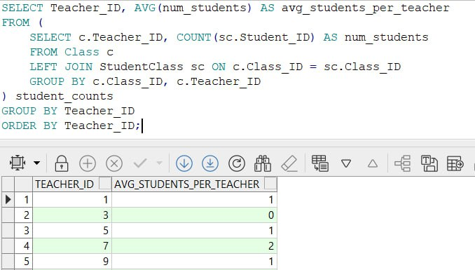

#### Query 2: This query calculates the total capacity used for each room type. It first joins the Class and Classroom tables to get the room type and capacity for each class. Then, it sums the capacities for each room type and shows the total capacity used for each type of room.
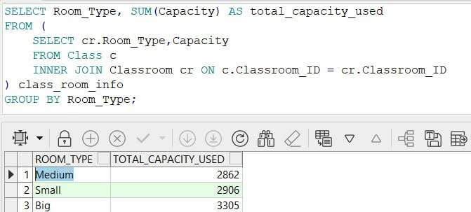

#### Query 3: find all the students who are enrolled in courses during the summer and were born between May and June
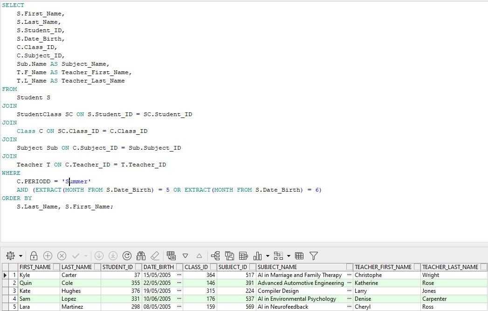

#### Query 4: This query finds the top three teachers with the highest average number of students per class. It starts by calculating the number of students each teacher has per class. Then, it averages these student counts for each teacher. Finally, it sorts the teachers by their average number of students per class in descending order and selects the top three.
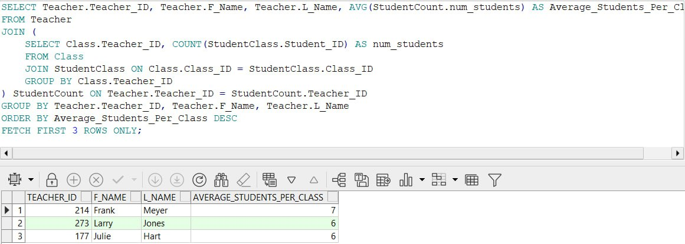

## Queries With Parameters

#### Query 1: This query finds students who are in classes taught by a certain teacher during a specific time period. It lists each student's first name, last name, student ID, class ID, and the subject they are taking. The results are sorted by the students' last names and first names.
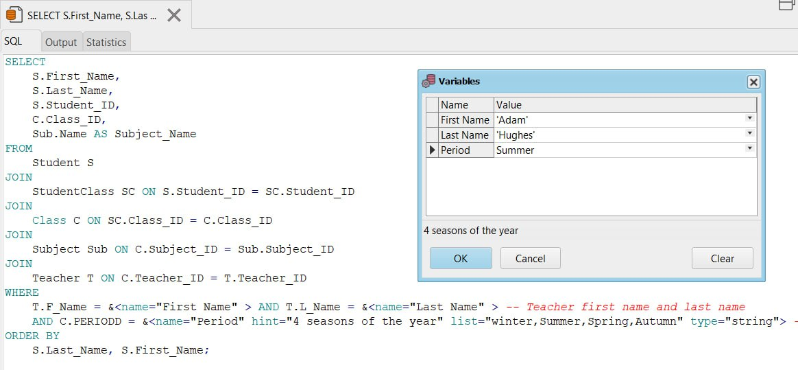
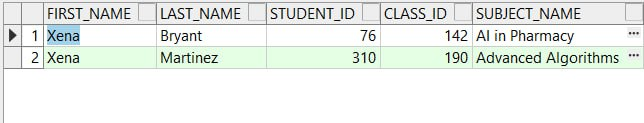

#### Query 2: This query finds students who are taking a specific subject during a specific time period. It lists each student's first name, last name, student ID, the subject name, the period, and the teacher's first and last names. The results are sorted by the students' last names and first names.


#### Query 3: This query tells us how many classes are scheduled in each type of classroom and within a certain size range. It lists classrooms by their IDs and types, along with their capacities. Then, it counts how many classes are held in each classroom within a specific size range. Finally, it sorts the classrooms from the smallest to the largest based on their capacities.
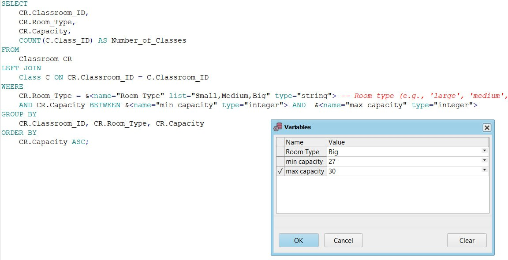


#### Query 4: This query finds students and their class details, like the period, time, teacher's name, and subject, based on their birth month and year. It organizes the results by students' names.
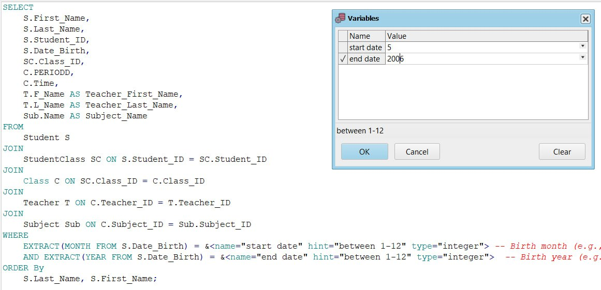
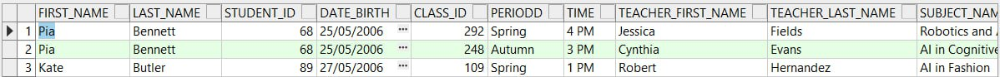

## Delete Queries

### Delete Query 1: This query deletes classes from the 'Class' table that have the 'Summer' period and have fewer than 5 students enrolled in them.

#### Run the select query to see how much data there is of this type:
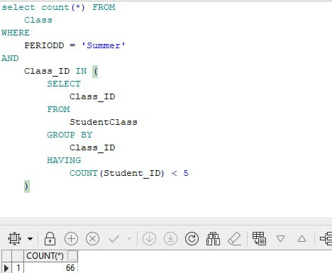

#### Running the delete query:
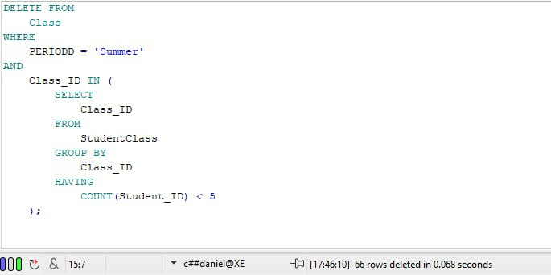

#### Running the table again and as you can see it dropped from 400 records to 334 (which is minus 66)
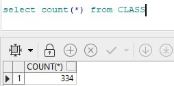

### Delete Query 2: This query deletes students from the 'Student' table who are not enrolled in any classes.
#### The table before the deletion:
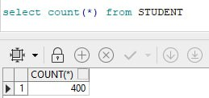
#### The delete query:
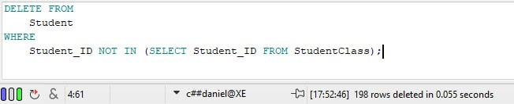
#### Running the table after the deletion and as you can see 198 records were deleted:
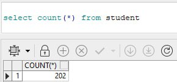
## Update Queries

### Update Query 1: This query updates the capacity of 'Medium' type classrooms to 30, for classrooms that are used by more than 2 classes.
#### Run the query before the update and as you can see there are 5 matching records:
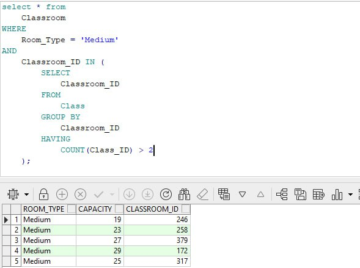
#### Running the update query:
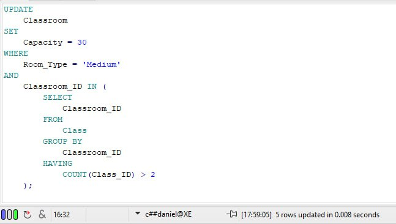
#### Run the query after the update and as you can see the capacity has changed to 30:


### Update Query 2: This query updates the 'RANK' of teachers by incrementing it by 1, for teachers who are assigned to more than 3 subjects.
#### Run the query before the update:
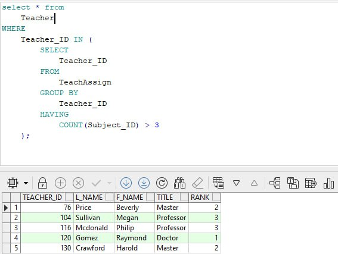
#### Running the update query:
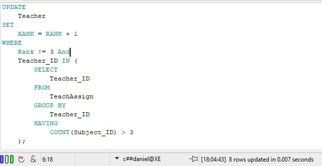
#### Run the query after the update and as you can see the RANK has changed to 3:


## Constraints

### Constraint 1:  This query modifies the Teacher table to set a default value of 1 
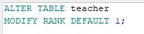

#### A change occurred in the table

```sql
create table TEACHER
(
    TEACHER_ID NUMBER           not null
        primary key,
    L_NAME     VARCHAR2(10)     not null,
    F_NAME     VARCHAR2(10)     not null,
    TITLE      VARCHAR2(10)     not null,
    RANK       NUMBER default 1 not null
)
```

### Constraint 2:  This query modifies the TeachAssign table to make the DateAssign column NOT NULL.
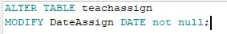

#### A change occurred in the table

```sql
create table TEACHASSIGN
(
    DATEASSIGN DATE   not null,
    SUBJECT_ID NUMBER not null
        references SUBJECT,
    TEACHER_ID NUMBER not null
        references TEACHER,
    primary key (SUBJECT_ID, TEACHER_ID)
)
```

#### Run error on data that contradicts the constraint

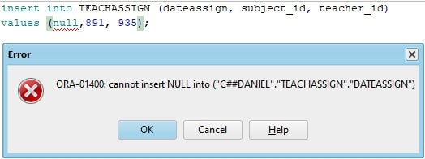

### Constraint 3: This query adds a constraint to the Student table to ensure that the Gradesheats column cannot have negative values.
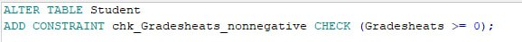

#### A change occurred in the table

```sql
create table STUDENT
(
    FIRST_NAME  VARCHAR2(10) not null,
    STUDENT_ID  NUMBER       not null
        primary key,
    DATE_BIRTH  DATE         not null,
    GRADESHEATS NUMBER       not null
        constraint CHK_GRADESHEATS_NONNEGATIVE
            check (Gradesheats >= 0),
    ADDRESS     VARCHAR2(20) not null,
    LAST_NAME   VARCHAR2(10) not null
)
```
#### Run error on data that contradicts the constraint

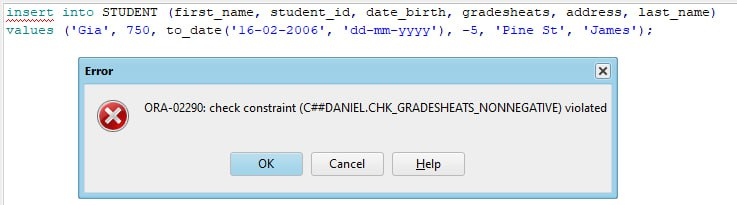

---

# Stage 3 Report


---

## Procedures

### Procedure 1: Updates the Rank field of teachers in the Teacher table based on the number of classes they are assigned.
####
```sql
CREATE OR REPLACE PROCEDURE update_teacher_rank IS
    CURSOR teacher_cursor IS
        SELECT Teacher_ID, COUNT(Class_ID) AS Num_Classes
        FROM Class
        GROUP BY Teacher_ID;

    v_teacher_id Teacher.Teacher_ID%TYPE;
    v_num_classes NUMBER;
BEGIN
    OPEN teacher_cursor;
    LOOP
        FETCH teacher_cursor INTO v_teacher_id, v_num_classes;
        EXIT WHEN teacher_cursor%NOTFOUND;

        IF v_num_classes >= 5 THEN
            UPDATE Teacher SET Rank = 3 WHERE Teacher_ID = v_teacher_id;
        ELSIF v_num_classes >= 3 THEN
            UPDATE Teacher SET Rank = 2 WHERE Teacher_ID = v_teacher_id;
        END IF;
    END LOOP;
    CLOSE teacher_cursor;
EXCEPTION
    WHEN OTHERS THEN
        DBMS_OUTPUT.PUT_LINE('An unexpected error occurred: ' || SQLERRM);
END update_teacher_rank;

```
#### Before the update (only some lecturers)


#### After the update (only some lecturers)
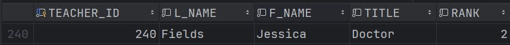
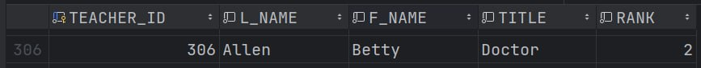
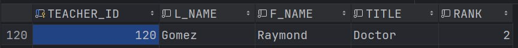

### Procedure 2: Generates a report listing each teacher, their assigned subjects, and the number of students enrolled in each subject.
```sql
CREATE OR REPLACE PROCEDURE Generate_Student_Enrollment_Report AS
    TYPE Enrollment_Record IS RECORD (
        Teacher_ID Teacher.Teacher_ID%TYPE,
        Teacher_Name VARCHAR2(50),
        Subject_Name Subject.Name%TYPE,
        Num_Students INT
    );
    TYPE Enrollment_Table IS TABLE OF Enrollment_Record INDEX BY PLS_INTEGER;
    v_Enrollment_Table Enrollment_Table;

    CURSOR c_Enrollment_Data IS
        SELECT t.Teacher_ID, t.F_Name || ' ' || t.L_Name AS Teacher_Name, sub.Name AS Subject_Name, COUNT(sc.Student_ID) AS Num_Students
        FROM Teacher t
        JOIN Class c ON t.Teacher_ID = c.Teacher_ID
        JOIN Subject sub ON c.Subject_ID = sub.Subject_ID
        LEFT JOIN StudentClass sc ON c.Class_ID = sc.Class_ID
        GROUP BY t.Teacher_ID, t.F_Name, t.L_Name, sub.Name;
BEGIN
    OPEN c_Enrollment_Data;
    FETCH c_Enrollment_Data BULK COLLECT INTO v_Enrollment_Table;
    CLOSE c_Enrollment_Data;

    -- Output the report
    FOR i IN v_Enrollment_Table.FIRST .. v_Enrollment_Table.LAST LOOP
        DBMS_OUTPUT.PUT_LINE('Teacher: ' || v_Enrollment_Table(i).Teacher_Name ||
                             ', Subject: ' || v_Enrollment_Table(i).Subject_Name ||
                             ', Number of Students: ' || v_Enrollment_Table(i).Num_Students);
    END LOOP;
EXCEPTION
    WHEN OTHERS THEN
        DBMS_OUTPUT.PUT_LINE('Error occurred: ' || SQLERRM);
        ROLLBACK;
END Generate_Student_Enrollment_Report;

```
#### Part of the output you can see that each lecturer is told what the course is and how many students are in the course:
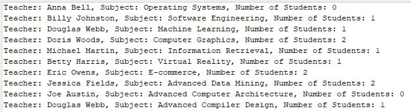

## Functions

### Function 1: Retrieves students' first names, last names, and calculates their ages based on their date of birth. It then categorizes them into specified age groups.
```sql
CREATE OR REPLACE FUNCTION get_students_by_age_group(
    min_age IN NUMBER,
    max_age IN NUMBER,
    counta OUT INT
) RETURN SYS_REFCURSOR IS
    student_cursor SYS_REFCURSOR;
    current_year NUMBER := EXTRACT(YEAR FROM SYSDATE);
    student_age NUMBER;
    fname VARCHAR(20);
    lname VARCHAR(20);
    count_record INT := 0;
BEGIN
    OPEN student_cursor FOR
    SELECT First_Name, Last_Name, EXTRACT(YEAR FROM Date_Birth) AS Birth_Year
    FROM Student;

    LOOP
        FETCH student_cursor INTO fname, lname, student_age;
        EXIT WHEN student_cursor%NOTFOUND;

        student_age := current_year - student_age;

        IF student_age >= min_age AND student_age <= max_age THEN
            count_record := count_record + 1;
            DBMS_OUTPUT.PUT_LINE('Student ' || fname || ' ' || lname || ' Age: ' || student_age);
        END IF;
    END LOOP;
    CLOSE student_cursor;

    -- Set the OUT parameter
    counta := count_record;

    -- Reopen the cursor to return the results
    OPEN student_cursor FOR
    SELECT First_Name, Last_Name, EXTRACT(YEAR FROM Date_Birth) AS Birth_Year
    FROM Student
    WHERE (current_year - EXTRACT(YEAR FROM Date_Birth)) BETWEEN min_age AND max_age;

    RETURN student_cursor;

EXCEPTION
    WHEN NO_DATA_FOUND THEN
        DBMS_OUTPUT.PUT_LINE('No students found in the specified age group');
        counta := 0;  -- Set OUT parameter to 0 in case of no data found
        RETURN NULL;
    WHEN OTHERS THEN
        DBMS_OUTPUT.PUT_LINE('An unexpected error occurred: ' || SQLERRM);
        counta := -1;  -- Set OUT parameter to -1 in case of an error
        RETURN NULL;
END get_students_by_age_group;
/

```
#### The input is "minimum age" 18 and "maximum age" 19:

#### Output of some students:
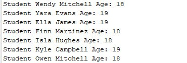
### Function 2: This function is designed to provide detailed information about classes based on a specified period, and handling potential errors 
```sql
CREATE OR REPLACE FUNCTION get_class_details_by_period(
    p_period IN VARCHAR2
) RETURN SYS_REFCURSOR IS
    class_cursor SYS_REFCURSOR;
    class_id NUMBER;
    subject_name VARCHAR2(50);
    teacher_name VARCHAR2(30);
BEGIN
    OPEN class_cursor FOR
    SELECT C.Class_ID, Sub.Name AS Subject_Name, T.F_Name || ' ' || T.L_Name AS Teacher_Name
    FROM Class C
    JOIN Subject Sub ON C.Subject_ID = Sub.Subject_ID
    JOIN Teacher T ON C.Teacher_ID = T.Teacher_ID
    WHERE C.PERIODD = p_period;

    LOOP
        FETCH class_cursor INTO class_id, subject_name, teacher_name;
        EXIT WHEN class_cursor%NOTFOUND;

        IF subject_name IS NULL THEN
            DBMS_OUTPUT.PUT_LINE('Subject name is missing for class ID: ' || class_id);
        ELSIF teacher_name IS NULL THEN
            DBMS_OUTPUT.PUT_LINE('Teacher name is missing for class ID: ' || class_id);
        ELSE
            DBMS_OUTPUT.PUT_LINE('Class ID: ' || class_id || ', Subject: ' || subject_name || ', Teacher: ' || teacher_name);
        END IF;
    END LOOP;
    CLOSE class_cursor;

    OPEN class_cursor FOR
    SELECT C.Class_ID, Sub.Name AS Subject_Name, T.F_Name || ' ' || T.L_Name AS Teacher_Name
    FROM Class C
    JOIN Subject Sub ON C.Subject_ID = Sub.Subject_ID
    JOIN Teacher T ON C.Teacher_ID = T.Teacher_ID
    WHERE C.PERIODD = p_period;

    RETURN class_cursor;

EXCEPTION
    WHEN NO_DATA_FOUND THEN
        DBMS_OUTPUT.PUT_LINE('No classes found for the specified period');
        RETURN NULL;
    WHEN OTHERS THEN
        DBMS_OUTPUT.PUT_LINE('An unexpected error occurred: ' || SQLERRM);
        RETURN NULL;
END get_class_details_by_period;

```
#### Inserting a "summer" variable into p_period:
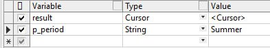
#### Some of the courses taught in the summer:


## Main Programs

### Program 1: A program that uses the function "get_students_by_age_group" and the procedure "update_teacher_rank;"
```sql
DECLARE
    student_cursor SYS_REFCURSOR;
    min_age NUMBER := 18;
    max_age NUMBER := 19;
    counta INT;
BEGIN
    -- Call the function
    student_cursor := get_students_by_age_group(min_age, max_age, counta);

    -- Print the number of records
    DBMS_OUTPUT.PUT_LINE('Number of students in the age group ' || min_age || ' to ' || max_age || ': ' || counta);

    update_teacher_rank;
EXCEPTION
    WHEN OTHERS THEN
        DBMS_OUTPUT.PUT_LINE('An unexpected error occurred: ' || SQLERRM);
END;

```
#### After we called the "age" function and made an update in the "rank" procedure, it prints how many records met the age conditions
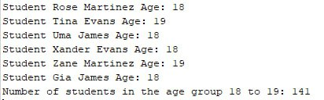


### Program 2: A program that uses the function "get_class_details_by_period" and the procedure "Generate_Student_Enrollment_Report;"
```sql
DECLARE
    class_details_cursor SYS_REFCURSOR;
    counta INT;
BEGIN
    -- Call the function to get class details by period
    class_details_cursor := get_class_details_by_period('Summer', counta);


    -- Call the procedure to generate student enrollment report
    Generate_Student_Enrollment_Report;
    
        -- Display the results
    DBMS_OUTPUT.PUT_LINE('Number of classes in the period group: '|| counta);
    
END;

```

### After we called the "period" and "Report" functions, they print the data separately. And at the end it prints how many courses in total there were in that period:
#### Course by period:

#### A teacher in a certain course and how many students there are:

#### The amount of matching records:
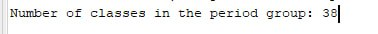

---
 # Stage 4 Report

---

## ERD and DSD 
### Our ERD:

### We used the backup of the second wing and built the dsd diagram through plsql:
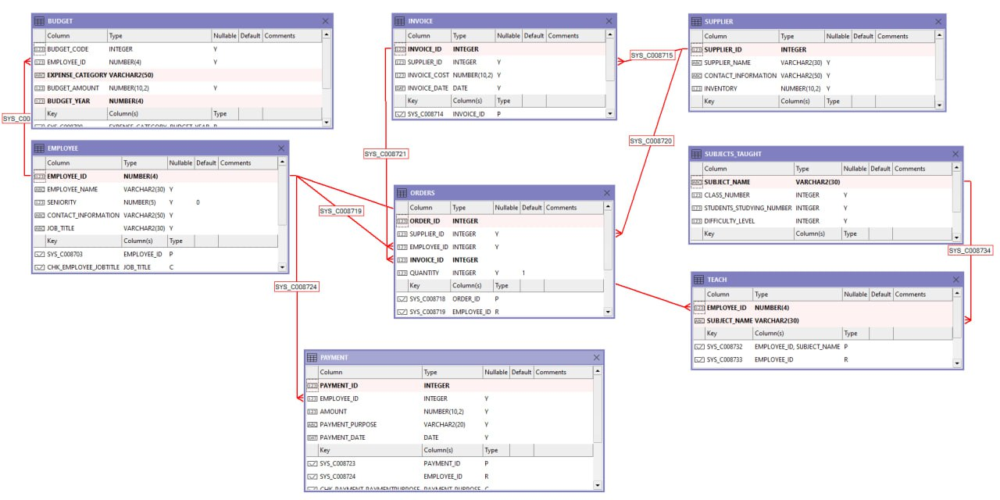

### By this dsd we built their erd.
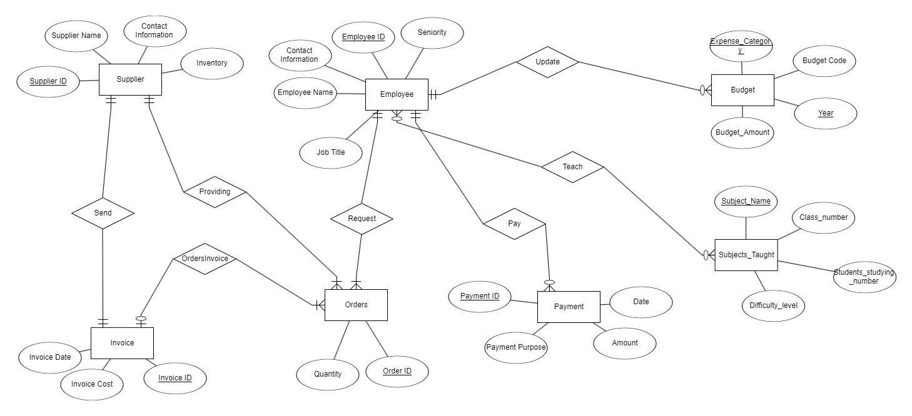

### After we have built erd we will extract the dsd from it and as you can see it is exactly the same as the dsd we extracted from plsql
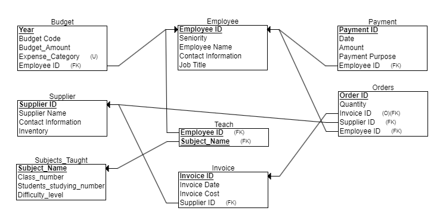

### After that we did an integration between the two wings
#### ERD:
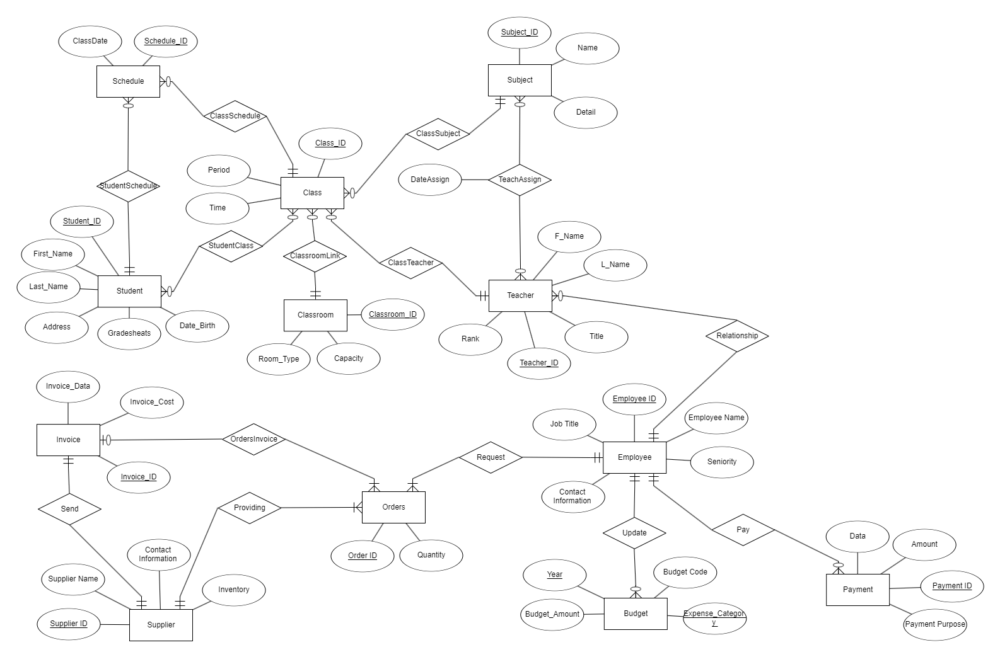
#### DSD:
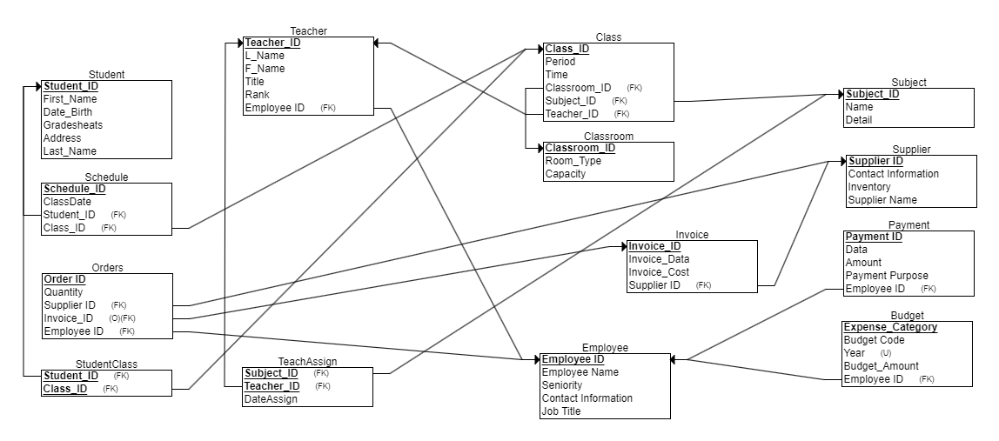

## Integration Decisions

### Step 1: Common Entity Alignment
We identified a common entity that provides us with the same data in both databases. Our entity is called `Subject` and their entity is called `Subjects_Taught`.

- **Action:** Delete the `Subjects_Taught` entity since it's redundant.
- **Result:** This also necessitated the deletion of the `teach` entity, which represented a many-to-many relationship between `Subjects_Taught` and `Employee`.

### Step 2: Enhancing Teacher Entity
To integrate the `Employee` entity from their database, we will enhance our `Teacher` entity.

- **Action:** Add a new column `Employee_ID` to the `Teacher` entity to represent the teacher's ID number as an employee.

## The Process and Commands
### First step: delete the teach table that contains a foreign key to Subjects_Taught:
#### The command:
```sql
drop table TEACH;
```
### Second step: delete the table Subjects_Taught:
#### The command:
```sql
drop table SUBJECTS_TAUGHT;
```
### Third step: We will insert a new column into the teacher table:
#### The command:
```sql
ALTER TABLE Teacher
ADD Employee_ID INT;

ALTER TABLE Teacher
ADD CONSTRAINT fk_employee
FOREIGN KEY (Employee_ID) REFERENCES Employee(Employee_ID);
```
### Fourth step: We will enter the data into the Employee_ID column in the teacher entity:
#### The command:
```sql
CREATE SEQUENCE teacher_employee_id_seq
START WITH 1500
INCREMENT BY 1
MAXVALUE 2000
NOCYCLE
CACHE 20;
BEGIN
    FOR rec IN (SELECT Teacher_ID FROM Teacher)
    LOOP
        UPDATE Teacher
        SET Employee_ID = teacher_employee_id_seq.NEXTVAL
        WHERE Teacher_ID = rec.Teacher_ID;
    END LOOP;
END;

```

## Views

### A view from the original wing:
#### View : Student and Class Details . This view combines student details with their class schedules.
```sql
CREATE OR REPLACE VIEW Student_Class_Details AS
SELECT 
    S.Student_ID,
    S.First_Name,
    S.Last_Name,
    C.Class_ID,
    C.PERIODD,
    C.Time,
    CL.Classroom_ID,
    Sub.Name AS Subject_Name
FROM 
    Student S
JOIN 
    StudentClass SC ON S.Student_ID = SC.Student_ID
JOIN 
    Class C ON SC.Class_ID = C.Class_ID
JOIN 
    Subject Sub ON C.Subject_ID = Sub.Subject_ID
JOIN 
    Classroom CL ON C.Classroom_ID = CL.Classroom_ID;

```
#### Output of select *:
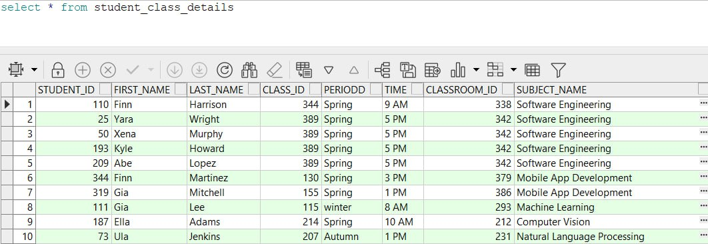
### A view from the wing we received:
#### View : Employee and Budget Details. This view provides information about employees and their associated budgets.
```sql
CREATE OR REPLACE VIEW Employee_Budget_Details AS
SELECT
    E.Employee_ID,
    E.Employee_Name,
    B.Budget_Code,
    B.Budget_Amount,
    B.Expense_Category,
    B.BUDGET_YEAR
FROM
    Employee E
JOIN
    Budget B ON E.Employee_ID = B.Employee_ID;
```
#### Output of select *:
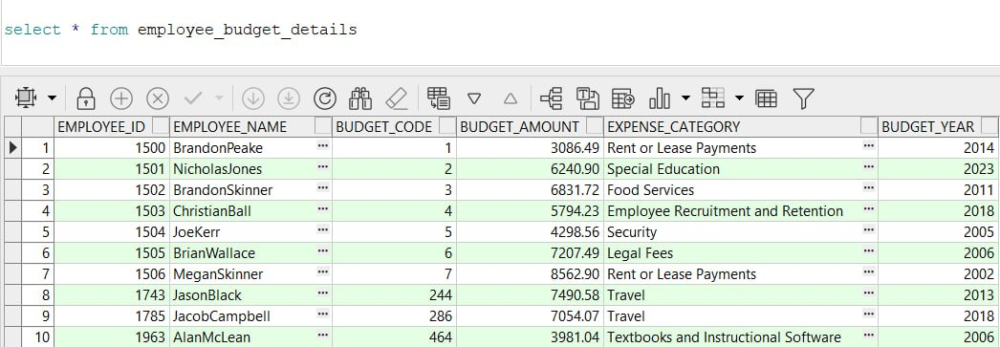
## Views Queries

### Queries about the view of our wing:
#### Query 1 : Retrieve all students with their class schedules and subjects.
```sql
SELECT 
    Student_ID, 
    First_Name, 
    Last_Name, 
    Class_ID, 
    PERIODD, 
    Time, 
    Classroom_ID, 
    Subject_Name
FROM 
    Student_Class_Details
ORDER BY 
    Student_ID, Class_ID;

```
#### Output:
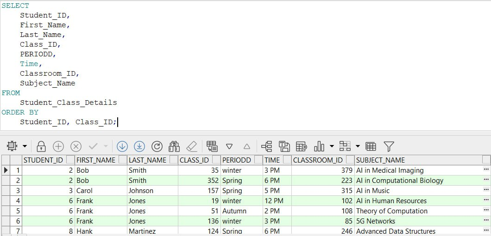
#### Query 2 : Find all classes that a specific student is enrolled in.
```sql
SELECT 
    Class_ID, 
    PERIODD, 
    Time, 
    Subject_Name
FROM 
    Student_Class_Details
WHERE 
    Student_ID = &<name="Id:">
ORDER BY 
    Class_ID;

```
#### Output:
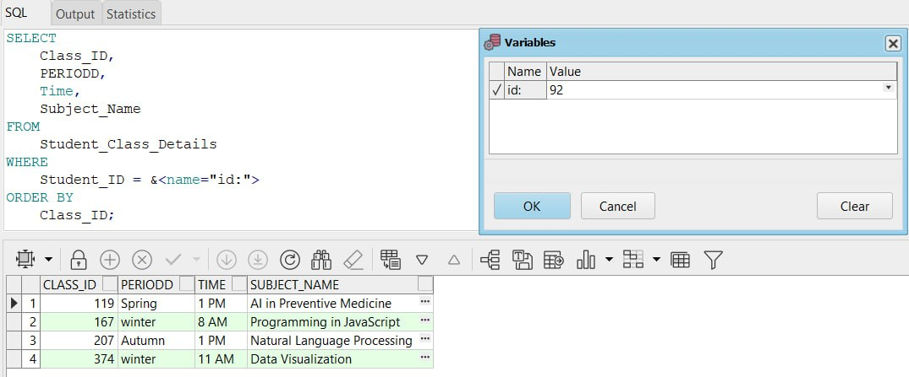

### Queries about the view of the wing we received:
#### Query 1: Retrieve all employees with their budget details.
```sql
SELECT
    Employee_ID,
    Employee_Name,
    Budget_Code,
    Budget_Amount,
    Expense_Category,
    BUDGET_YEAR
FROM
    Employee_Budget_Details
ORDER BY
    Employee_ID, Budget_Code;
```
#### Output:
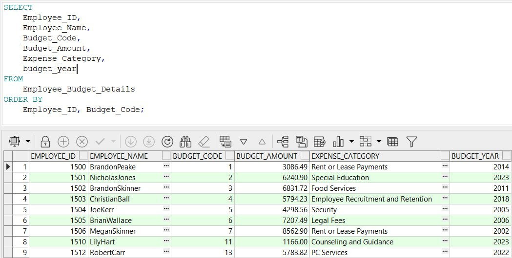
#### Query 2: Find budget details for a specific employee.
```sql
SELECT
    Budget_Code,
    Budget_Amount,
    Expense_Category,
    Budget_Year
FROM
    Employee_Budget_Details
WHERE
    Employee_ID = &<name="employee id:">
ORDER BY
    Budget_Year;
```
#### Output:
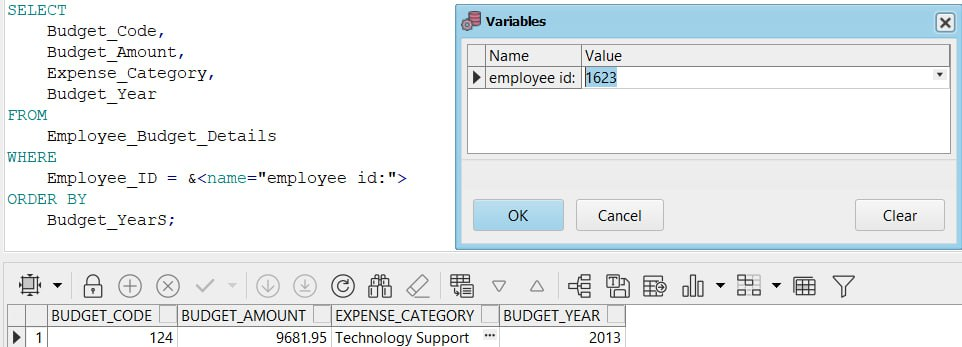