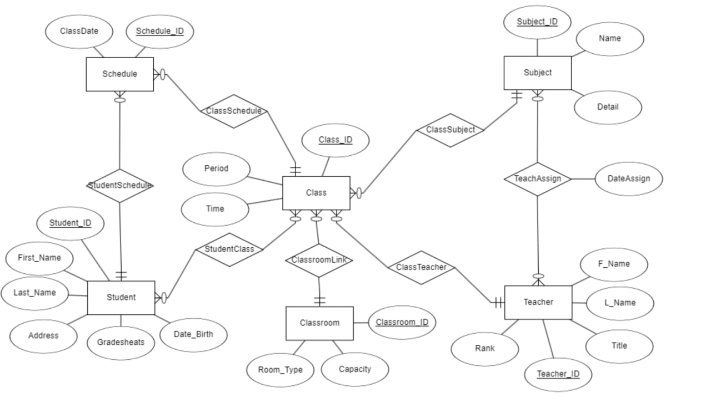
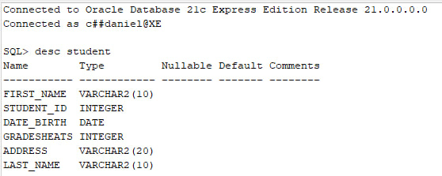
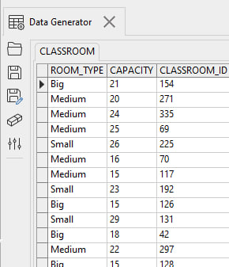
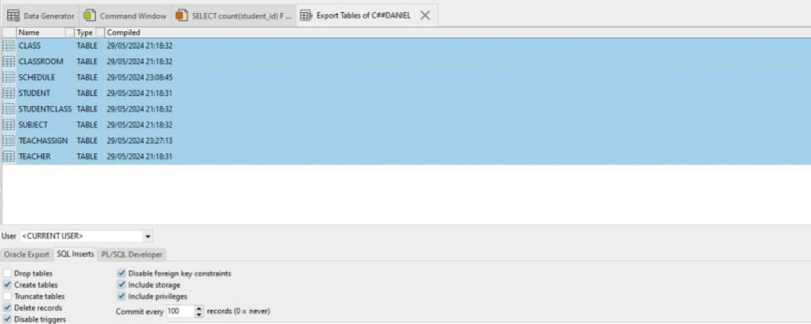
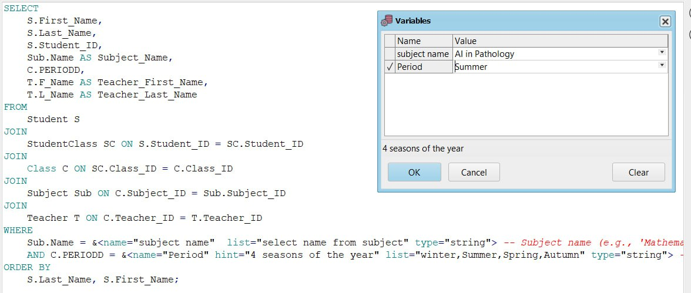
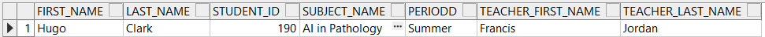
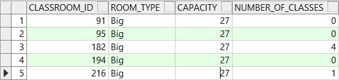

---

# Project Report 


---

## Presenters
- **Daniel Shalom Cohen** - ID: 212991749
- **Nati Stern** - ID: 322879255


## Table of Contents
### stage 1
1. [Introduction](#introduction)
2. [ERD and DSD Diagrams](#erd-and-dsd-diagrams)
3. [Design Decisions](#design-decisions)
4. [Create Table Commands](#create-table-commands)
5. [Data Entry Methods](#data-entry-methods)
6. [Data Backup and Restoration](#data-backup-and-restoration)

### stage 2
1. [Queries Without Parameters](#Queries-Without-Parameters)
2. [Queries With Parameters](#Queries-With-Parameters)
3. [Delete Queries](#Delete-Queries)
4. [Update Queries](#Update-Queries)
5. [Constraints](#Constraints)

---

 # Stage 1 Report

---
### Introduction 

This system serves as a comprehensive database management tool for managing students, teachers, classes, schedules, subjects, and classrooms in an educational institution. It enables efficient organization and tracking of academic data, including student information, class schedules, teacher assignments, and classroom details.

#### Data Description:

1. **Student:**
   - **Description:** Represents individual students enrolled in the educational institution.
   - **Attributes:**
     - First_Name: First name of the student.
     - Last_Name: Last name of the student.
     - Student_ID: Unique identifier for each student.
     - Date_Birth: Date of birth of the student.
     - Gradesheats: Grade level or academic year of the student.
     - Address: Address of the student.
   - **Purpose:** Tracks student demographics, academic records, and enrollment details.

2. **Teacher:**
   - **Description:** Represents educators employed by the educational institution.
   - **Attributes:**
     - Teacher_ID: Unique identifier for each teacher.
     - F_Name: First name of the teacher.
     - L_Name: Last name of the teacher.
     - Title: Title or designation of the teacher.
     - Rank: Level or rank of the teacher (e.g., junior, senior).
   - **Purpose:** Stores information about teachers' profiles, qualifications, and assignments.

3. **Subject:**
   - **Description:** Represents academic subjects offered by the educational institution.
   - **Attributes:**
     - Subject_ID: Unique identifier for each subject.
     - Name: Name or title of the subject.
     - Detail: Additional details or description of the subject.
   - **Purpose:** Catalogs information about the curriculum, course offerings, and academic disciplines.

4. **Classroom:**
   - **Description:** Represents physical spaces used for conducting classes.
   - **Attributes:**
     - Classroom_ID: Unique identifier for each classroom.
     - Room_Type: Type or category of the classroom (e.g., lecture hall, laboratory).
     - Capacity: Maximum seating capacity of the classroom.
   - **Purpose:** Maintains details about classroom facilities, capacities, and availability.

5. **TeachAssign:**
   - **Description:** Represents assignments of teachers to specific subjects.
   - **Attributes:**
     - Subject_ID: Foreign key referencing the Subject table.
     - Teacher_ID: Foreign key referencing the Teacher table.
     - DateAssign: Date of joining to study a subject.
   - **Purpose:** Establishes relationships between teachers and subjects they are assigned to teach.

6. **Class:**
   - **Description:** Represents individual classes or courses offered by the educational institution.
   - **Attributes:**
     - Class_ID: Unique identifier for each class.
     - PERIODD: Period or session of the class.
     - Time: Time schedule of the class.
     - Classroom_ID: Foreign key referencing the Classroom table.
     - Subject_ID: Foreign key referencing the Subject table.
     - Teacher_ID: Foreign key referencing the Teacher table.
   - **Purpose:** Organizes class schedules and links them to specific subjects, teachers, and classrooms.

7. **Schedule:**
   - **Description:** Represents schedules or timetables for classes.
   - **Attributes:**
     - Schedule_ID: Unique identifier for each schedule entry.
     - ClassDate: Date of the class.
     - Student_ID: Foreign key referencing the Student table.
     - Class_ID: Foreign key referencing the Class table.
   - **Purpose:** Records class schedules for individual students.

8. **StudentClass:**
   - **Description:** Represents the enrollment of students in specific classes.
   - **Attributes:**
     - Student_ID: Foreign key referencing the Student table.
     - Class_ID: Foreign key referencing the Class table.
   - **Purpose:** Establishes relationships between students and classes they are enrolled in.

The system aims to facilitate efficient management of academic data and streamline processes related to student enrollment, class scheduling, teacher assignments, and curriculum management.
***

### ERD and DSD Diagrams




### Design Decisions

In designing the database schema, careful consideration was given to the establishment of foreign keys to enforce referential integrity and maintain relationships between different tables. Here's an explanation of each foreign key and its related table:

#### TeachAssign Foreign Keys:
- **Subject_ID:** This foreign key references the `Subject` table's `Subject_ID` column, establishing a relationship between the `TeachAssign` table and the `Subject` table to indicate which subjects are assigned to teachers.
- **Teacher_ID:** This foreign key references the `Teacher` table's `Teacher_ID` column, establishing a relationship between the `TeachAssign` table and the `Teacher` table to indicate which teachers are assigned to teach specific subjects.

#### Class Foreign Keys:
- **Classroom_ID:** This foreign key references the `Classroom` table's `Classroom_ID` column, establishing a relationship between the `Class` table and the `Classroom` table to indicate which classroom is assigned to a particular class.
- **Subject_ID:** This foreign key references the `Subject` table's `Subject_ID` column, establishing a relationship between the `Class` table and the `Subject` table to indicate which subject is being taught in a particular class.
- **Teacher_ID:** This foreign key references the `Teacher` table's `Teacher_ID` column, establishing a relationship between the `Class` table and the `Teacher` table to indicate which teacher is assigned to teach a particular class.

#### Schedule Foreign Keys:
- **Student_ID:** This foreign key references the `Student` table's `Student_ID` column, establishing a relationship between the `Schedule` table and the `Student` table to indicate which student is enrolled in a particular class schedule.
- **Class_ID:** This foreign key references the `Class` table's `Class_ID` column, establishing a relationship between the `Schedule` table and the `Class` table to indicate which class the schedule is associated with.

#### StudentClass Foreign Keys:
- **Student_ID:** This foreign key references the `Student` table's `Student_ID` column, establishing a relationship between the `StudentClass` table and the `Student` table to indicate which student is enrolled in a particular class.
- **Class_ID:** This foreign key references the `Class` table's `Class_ID` column, establishing a relationship between the `StudentClass` table and the `Class` table to indicate which class the student is enrolled in.

These foreign key relationships ensure the integrity of the database and maintain consistency between related tables, enabling accurate data retrieval and manipulation.
***

### Create Table and desc Commands
#### Create Table Command


```sql
CREATE TABLE Student
(
  First_Name VARCHAR(10) NOT NULL,
  Student_ID INT NOT NULL,
  Date_Birth DATE NOT NULL,
  Gradesheats INT NOT NULL,
  Address VARCHAR(20) NOT NULL,
  Last_Name VARCHAR(10) NOT NULL,
  PRIMARY KEY (Student_ID)
);

CREATE TABLE Teacher
(
  Teacher_ID INT NOT NULL,
  L_Name VARCHAR(10) NOT NULL,
  F_Name VARCHAR(10) NOT NULL,
  Title VARCHAR(10) NOT NULL,
  Rank INT NOT NULL,
  PRIMARY KEY (Teacher_ID)
);

CREATE TABLE Subject
(
  Subject_ID INT NOT NULL,
  Name VARCHAR(50) NOT NULL,
  Detail VARCHAR(100) NOT NULL,
  PRIMARY KEY (Subject_ID)
);

CREATE TABLE Classroom
(
  Room_Type VARCHAR(10) NOT NULL,
  Capacity INT NOT NULL,
  Classroom_ID INT NOT NULL,
  PRIMARY KEY (Classroom_ID)
);

CREATE TABLE TeachAssign
(
  DateAssign DATE,
  Subject_ID INT NOT NULL,
  Teacher_ID INT NOT NULL,
  PRIMARY KEY (Subject_ID, Teacher_ID),
  FOREIGN KEY (Subject_ID) REFERENCES Subject(Subject_ID),
  FOREIGN KEY (Teacher_ID) REFERENCES Teacher(Teacher_ID)
);

CREATE TABLE Class
(
  Class_ID INT NOT NULL,
  PERIODD VARCHAR(10) NOT NULL,
  Time VARCHAR(10) NOT NULL,
  Classroom_ID INT NOT NULL,
  Subject_ID INT NOT NULL,
  Teacher_ID INT NOT NULL,
  PRIMARY KEY (Class_ID),
  FOREIGN KEY (Classroom_ID) REFERENCES Classroom(Classroom_ID),
  FOREIGN KEY (Subject_ID) REFERENCES Subject(Subject_ID),
  FOREIGN KEY (Teacher_ID) REFERENCES Teacher(Teacher_ID)
);

CREATE TABLE Schedule
(
  ClassDate VARCHAR(10) NOT NULL,
  Schedule_ID INT NOT NULL,
  Student_ID INT NOT NULL,
  Class_ID INT NOT NULL,
  PRIMARY KEY (Schedule_ID),
  FOREIGN KEY (Student_ID) REFERENCES Student(Student_ID),
  FOREIGN KEY (Class_ID) REFERENCES Class(Class_ID)
);

CREATE TABLE StudentClass
(
  Student_ID INT NOT NULL,
  Class_ID INT NOT NULL,
  PRIMARY KEY (Student_ID, Class_ID),
  FOREIGN KEY (Student_ID) REFERENCES Student(Student_ID),
  FOREIGN KEY (Class_ID) REFERENCES Class(Class_ID)
);
```
#### Desc Command

***

### Data Entry Methods
- Data Generate file.
- Text file.
- Python script.


**Data Generate file:**





**Text file:**


**Python script:**
```python
import random
import string

# Function to generate a random string for L_Name, F_Name, and Title
def random_string(length):
    letters = string.ascii_letters
    return ''.join(random.choice(letters) for _ in range(length))

# Number of records to insert
num_records = 500

# Generate SQL insert queries
queries = []
for i in range(1, num_records + 1):
    teacher_id = i
    l_name = random_string(10)  # Generate a random string of length 10 for L_Name
    f_name = random_string(10)  # Generate a random string of length 10 for F_Name
    title = random_string(10)   # Generate a random string of length 10 for Title
    level = random.randint(1, 10)  # Generate a random integer between 1 and 10 for Level
    query = f"INSERT INTO Teacher (Teacher_ID, L_Name, F_Name, Title, Level) VALUES ({teacher_id}, '{l_name}', '{f_name}', '{title}', {level});"
    queries.append(query)

# Write queries to a file
with open('insert_queries.sql', 'w') as f:
    for query in queries:
        f.write(query + '\n')
```
***
### Data Backup and Restoration




---

# Stage 2 Report


---

## Queries Without Parameters

### Query 1: This query finds out how many students each teacher has on average. It first counts the students in each class and then averages these counts for each teacher. Finally, it shows the average number of students for each teacher, sorted by the teacher's ID.


### Query 2: This query calculates the total capacity used for each room type. It first joins the Class and Classroom tables to get the room type and capacity for each class. Then, it sums the capacities for each room type and shows the total capacity used for each type of room.


### Query 3: [Hebrew Description of Query 3]


### Query 4: This query finds the top three teachers with the highest average number of students per class. It starts by calculating the number of students each teacher has per class. Then, it averages these student counts for each teacher. Finally, it sorts the teachers by their average number of students per class in descending order and selects the top three.


## Queries With Parameters

### Query 1: This query finds students who are in classes taught by a certain teacher during a specific time period. It lists each student's first name, last name, student ID, class ID, and the subject they are taking. The results are sorted by the students' last names and first names.


### Query 2: This query finds students who are taking a specific subject during a specific time period. It lists each student's first name, last name, student ID, the subject name, the period, and the teacher's first and last names. The results are sorted by the students' last names and first names.



### Query 3: This query tells us how many classes are scheduled in each type of classroom and within a certain size range. It lists classrooms by their IDs and types, along with their capacities. Then, it counts how many classes are held in each classroom within a specific size range. Finally, it sorts the classrooms from the smallest to the largest based on their capacities.



### Query 4: This query finds students and their class details, like the period, time, teacher's name, and subject, based on their birth month and year. It organizes the results by students' names.


## Delete Queries

### Delete Query 1: [Hebrew Description of Delete Query 1]


### Delete Query 2: [Hebrew Description of Delete Query 2]


## Update Queries

### Update Query 1: [Hebrew Description of Update Query 1]


### Update Query 2: [Hebrew Description of Update Query 2]


## Constraints

### Constraint 1: [Hebrew Description of Constraint 1]


### Constraint 2: [Hebrew Description of Constraint 2]


### Constraint 3: [Hebrew Description of Constraint 3]


### Constraint 4: [Hebrew Description of Constraint 4]

